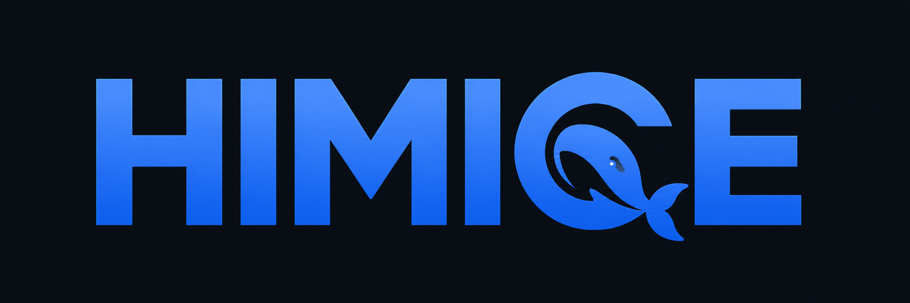

# Awesome Himice SOP Skills

<p align="center">
  
</p>

面向 Himice 同事的本地优先活动执行 Skill 库。它将项目预算、备用金申请、操作费用报销、会议转录和 Office 文件处理，分别适配到 OpenAI Codex、DeepSeek Harness（DSH）与 Claude Code。

客户报价、发票、录音、税号、联系人和员工信息默认只在本地处理。仓库只保存空白模板、通用规则和上游工具说明；经项目负责人确认可公开使用的企业级 MICE 行业基线数据，单列在 `projects/mice-bid-enterprise-directory/`，并保留来源与核验口径。

## 快速开始

```bash
git clone https://github.com/Jaywang1013/Awesome-Himice-SOP-skill.git
cd Awesome-Himice-SOP-skill

# 先预览，再安装核心 SOP Skills（任选一个平台）
bash scripts/install.sh --platform codex --bundle core --dry-run
bash scripts/install.sh --platform codex --bundle core

# DSH 或 Claude Code
bash scripts/install.sh --platform dsh --bundle core
bash scripts/install.sh --platform claude-code --bundle core
```

安装脚本不会覆盖已有本地 Skill；同事更新前请先备份或手动移除旧目录。重新启动所用 Agent 后，即可调用对应的 `himice-*` Skill。

若还需 Excel/Word/PPT/PDF、文件读取、在线办公、通知审批、设计提案、企业知识库和 MICE 招投标企业库能力：

```bash
bash scripts/install.sh --platform codex --bundle general
# 或 --bundle all 同时安装核心 SOP 与企业办公能力
```

## Skill 总目录

下表列出仓库全部 18 个独立 Skill。Codex、DSH、Claude Code 中的同名目录是同一 Skill 的运行时适配副本，不重复计数。

### 核心 SOP Skills

这些是 Himice 活动项目从前期到后期的核心业务流程，使用 `--bundle core` 安装。

| Skill | 平台 | 负责什么 | 主要输出 |
| --- | --- | --- |
| `himice-budget-process` | Codex / DSH / Claude Code | 根据客户报价和供应商成本制作预算表；填写会议信息，处理代付服务费、操作费用、现金项、板块合并和公式核验。 | 项目预算表、金额与公式核验结果。 |
| `himice-advance-fund-application-process` | Codex / DSH / Claude Code | 从项目预算表生成预估协作人审批表（备用金申请表）；填写营业额、毛利、客户、税号和报账人，并在每次调用时确认部门默认信息。 | 备用金申请表；客户与税号仅本地处理。 |
| `himice-operating-expense-reimbursement-process` | Codex / DSH / Claude Code | 将发票、滴滴/货拉拉行程单、支付截图和经手人录入单表；逐笔拆分行程、按路线写备注、勾选发票并核对金额。 | 项目操作收支明细表与票据核验结果。 |
| `himice-vibevoice` | Codex / DSH / Claude Code | 转写已获授权的会议、展览和活动录音；结合 Himice、会展与厦门术语提炼纪要、行动项和待确认事项。 | 带时间信息的转写、会议纪要和行动清单。 |
| `himice-officecli` | Codex / DSH / Claude Code | 使用 OfficeCLI 读取、修改、校验和渲染 Excel、Word、PowerPoint，重点保护公司模板格式、金额格式与公式。 | 经校验的 Office 文件和预览。 |

### 通用办公 Skills

这些是可与核心 SOP 搭配的通用能力，使用 `--bundle general` 安装。

| Skill | 平台 | 负责什么 | 依赖或边界 |
| --- | --- | --- | --- |
| `himice-office-files` | Codex / DSH / Claude Code | 创建、读取、编辑和核验 Excel、Word、PowerPoint、PDF；为通用办公文件选择正确的官方 Skill 或 OfficeCLI。 | Codex 使用官方办公能力；DSH 使用 Univer/OfficeCLI；Claude 使用 Anthropic document-skills/OfficeCLI。 |
| `himice-file-intake` | Codex / DSH / Claude Code | 读取、转换、批量整理 PDF、Office、图片、网页和常见附件，并保留来源。 | 使用官方附件能力或 MarkItDown；敏感原件遵循本地处理规则。 |
| `himice-online-office` | Codex / DSH / Claude Code | 通过已授权的 Google Workspace CLI、MCP 或连接器操作 Drive、Docs、Sheets、Slides、Gmail 和 Calendar。 | 写入、共享、发送前必须确认目标与内容。 |
| `himice-notification-approval` | Codex / DSH / Claude Code | 发送通知、请求人工确认、记录审批状态，并对接可用的 Connector、MCP 或通知插件。 | 不自行假设连接器已授权；外部消息与审批必须先确认。 |
| `himice-design-proposals` | Codex / DSH / Claude Code | 制作活动主视觉、提案、原型、演示和多格式设计交付物。 | 使用 OpenDesign、Canva 或已安装设计 Skills；先确认品牌资产和导出格式。 |
| `himice-enterprise-knowledge` | Codex / DSH / Claude Code | 检索、汇总和维护 Notion、Google Drive、SharePoint 等企业知识源，输出可追溯结论。 | 只使用已授权知识源，继承原系统权限。 |
| `himice-mice-bid-directory` | Codex / DSH / Claude Code | 从本地全国会展产业链企业/机构主表筛选招投标候选池，保留来源、可信度、核验状态和待办。 | 不替代采购准入或资格审查；公开联系方式仅用于获授权的核验/业务联系。 |

### 通用集成 Skills（DSH）

这些是 DSH 专用的通用插件包装，使用 `--bundle general` 安装。Skill 说明会安装到本地；对应上游插件、桌面应用或凭据仍须单独配置。

| Skill | 负责什么 | 额外要求 |
| --- | --- | --- |
| `dsh-file-upload` | 上传并识别 PDF、Office、图片、压缩包和文本；通过 MarkItDown 转为可读取内容。 | 单独安装同名 DSH 插件。 |
| `dsh-vision-router` | 图片看图问答、OCR、元素定位、像素对比、取色、抠图与 SVG 矢量化。 | 单独安装同名 DSH 插件，并确认视觉模型配置。 |
| `dsh-dingtalk` | 向钉钉群发送 Markdown 或纯文本项目通知。 | 配置钉钉群机器人 Webhook 与安全签名。 |
| `dsh-notifier` | 在任务结束、等待确认或失败时，将通知推送到钉钉、飞书、企业微信等渠道。 | 单独安装插件并配置所需渠道凭据。 |
| `open-design` | 生成活动视觉、网页/移动端原型、看板、演示、图片、视频与动效。 | 安装 OpenDesign 桌面应用；它不是 DSH 内置插件。 |
| `pptfast` | 将大纲、笔记或文档生成原生可编辑 PPTX，并支持主题、校验、渲染与品牌提取。 | 单独安装 DSH 插件，按上游要求准备 Node 环境。 |

每项上游来源、安装方式和许可证提示见 [integrations/](integrations/)。

## 仓库结构

```text
.
├── skills/                           # 可部署的核心 SOP Skills
│   ├── codex/                        # ~/.codex/skills/<skill>/
│   ├── deepseek-harness/skills/      # ~/.dsh/skills/<skill>/
│   └── claude-code/skills/           # ~/.claude/skills/<skill>/
├── integrations/                     # 上游插件与外部办公工具的接入说明
│   ├── deepseek-harness/
│   ├── dingtalk/
│   ├── design/
│   └── presentations/
├── projects/                         # 可选能力项目，不影响核心 SOP
│   ├── enterprise-productivity-stack/
│   ├── himice-agent-platform-blueprint/
│   └── mice-bid-enterprise-directory/ # 招投标 MICE 行业上下游企业一览（仍在补充）
├── scripts/                          # 安装与校验脚本
├── docs/                             # 维护与公开仓库安全规范
├── AGENTS.md                         # 给维护者与编码 Agent 的仓库约定
└── assets/                           # README 展示素材
```

目录采用 Agent Skills 的通用组织方式：每个 Skill 是一个独立文件夹，必含 `SKILL.md`，并按需包含 `agents/`、`references/`、`assets/` 或 `scripts/`。详细的处理规则不堆在入口文件中，而由 `SKILL.md` 按需指向 reference，避免无关上下文进入每次调用。

## 平台与安装位置

| 平台 | 源目录 | 本地安装目录 | 调用方式 |
| --- | --- | --- | --- |
| Codex | `skills/codex/` | `~/.codex/skills/` | `$himice-budget-process` 等 |
| DSH | `skills/deepseek-harness/skills/` | `~/.dsh/skills/` | 直接描述任务或点名 Skill |
| Claude Code | `skills/claude-code/skills/` | `~/.claude/skills/` | `/himice-budget-process` 等 |

企业办公能力矩阵位于 [`projects/enterprise-productivity-stack/`](projects/enterprise-productivity-stack/)，覆盖三平台的办公文件、附件读取、在线办公、通知审批、设计提案与企业知识库六类能力。

招投标企业库位于 [`projects/mice-bid-enterprise-directory/`](projects/mice-bid-enterprise-directory/)。安装 `--bundle general` 时，`himice-mice-bid-directory` 和经确认可公开使用的企业/机构基线会一同安装到 `~/.himice/mice-bid-enterprise-directory/data/`；候选池仍须按招标文件和公开权威来源复核。

## DSH 上游插件

DSH 的 Skill 说明会随本仓库安装；下列插件本体仍需按上游说明单独安装、配置凭据并重启 DSH：

```bash
dsh plugin --profile web add dsh-file-upload
dsh plugin --profile web add dsh-vision-router
dsh plugin --profile web add dsh-dingtalk
dsh plugin --profile web add dsh-notifier
dsh plugin --profile web add pptfast
```

`open-design` 是桌面应用，不是 DSH 内置插件。请从其官方项目安装后，再将 DSH 配置为可用运行时。安装前请阅读对应 [integration guide](integrations/)。

## 企业 Agent 与钉钉

[`projects/himice-agent-platform-blueprint/`](projects/himice-agent-platform-blueprint/) 记录现有 Skills 如何连接 Codex、DSH、Claude Code、千问和钉钉：包括架构、选型、分阶段部署、统一接口和安全治理。

千问办公会员、千问 API/百炼额度与钉钉开放平台权限是三种独立授权。会员可降低员工的 AI 办公使用门槛，但不会自动授予钉钉机器人、组织数据或生产 API 权限。钉钉接入优先参考官方 [DingTalk Workspace CLI](https://github.com/DingTalk-Real-AI/dingtalk-workspace-cli) 与企业机器人 Stream 模式；先在脱敏测试群试点，再处理真实业务资料。

## 上游与使用边界

- `himice-officecli` 参考 [iOfficeAI/OfficeCLI](https://github.com/iOfficeAI/OfficeCLI)，不包含其源码或二进制。
- `himice-vibevoice` 参考 [microsoft/VibeVoice](https://github.com/microsoft/VibeVoice)，不包含其模型或源码。
- DSH 文件、视觉、钉钉通知、设计和 PPT 能力都只是上游项目的接入说明；具体来源见 [`integrations/`](integrations/)。
- Anthropic 的 `docx`、`xlsx`、`pptx`、`pdf` 能力入口见 [`projects/enterprise-productivity-stack/anthropic-document-skills/`](projects/enterprise-productivity-stack/anthropic-document-skills/)，不在本仓库复制上游内容。
- 本仓库未声明开放源码许可。公开可见不等于可任意再发布；公司内部使用和第三方内容使用均应遵循公司授权及各上游许可证。

## 维护与安全

- 维护规则见 [docs/maintaining-skills.md](docs/maintaining-skills.md)。
- 公开仓库安全边界见 [docs/public-repository-safety.md](docs/public-repository-safety.md)。
- 提交前运行：`bash scripts/validate.sh && git diff --check`。
- 每次修改业务规则、内置模板或金额处理时，必须同步三套运行时版本，并使用脱敏样例进行核验。
