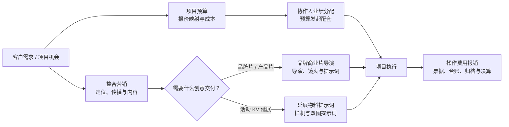
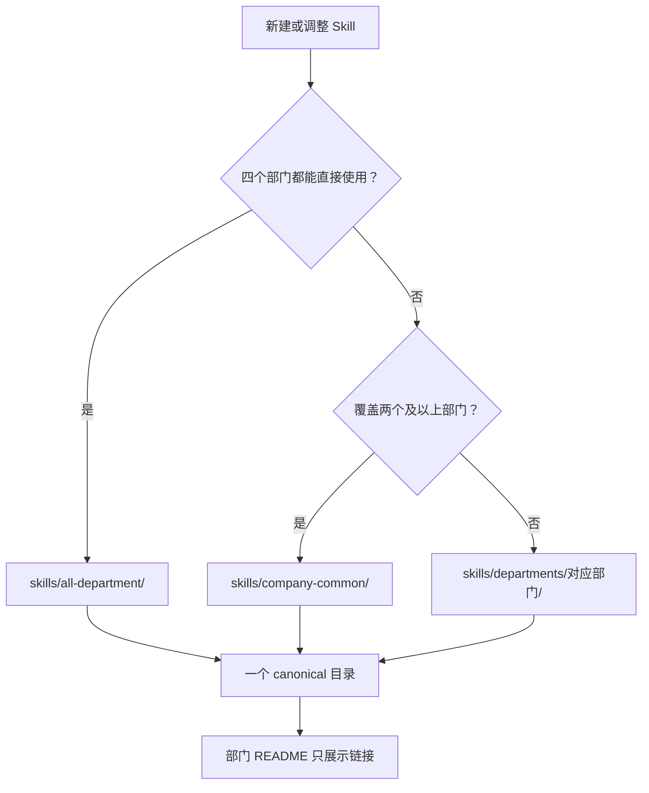
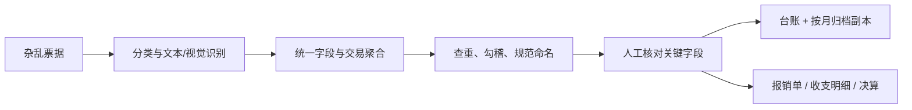
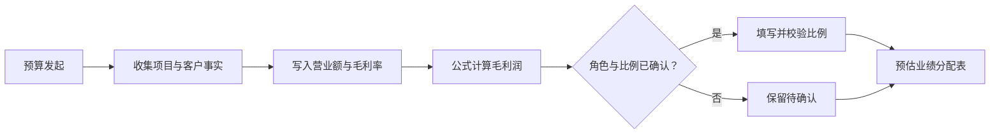
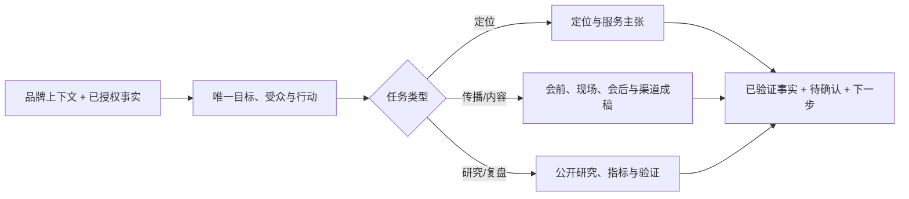
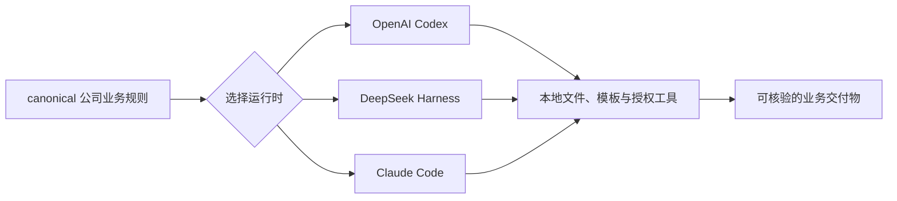

# Awesome Himice SOP Skills

<p align="center">
  
</p>

<p align="center"><a href="assets/himice-hero.png">查看静态版首页图</a></p>

<p align="center">
  <strong>把公司的真实工作方法，变成可复用、可校验、可持续迭代的 AI 工作技能。</strong>
</p>

<p align="center">
  <a href=".github/workflows/validate-department-skills.yml"></a>
  
  
  
</p>

这是面向 Himice 同事的本地优先公司 Skill 库。它既包含按公司部门和真实业务流程组织的 canonical Skill，也保留 Codex、DeepSeek Harness（DSH）与 Claude Code 的运行时适配包。

客户报价、发票、录音、税号、联系人和员工信息默认只在本地处理。仓库只保存空白模板、通用规则和上游工具说明；经项目负责人确认可公开使用的企业级 MICE 行业基线数据，单列在 `projects/mice-bid-enterprise-directory/`，并保留来源与核验口径。

## 快速导航

[按部门找 Skill](#按部门找-skill) · [看公司工作流](#公司工作流) · [查看 6 个业务 Skill](#业务-skill-总览) · [安装到本地](#安装与快速开始) · [多平台能力目录](#多平台能力目录) · [仓库结构](#仓库结构) · [安全与维护](#维护与安全)

## 按部门找 Skill

每个业务 Skill 只有一个真实目录。跨部门 Skill 放在公司通用或全部门通用目录，各部门 README 只做导航，不复制 `SKILL.md`、`references/` 或模板。

| 分类 | 判断标准 | 入口 |
| --- | --- | --- |
| 全部门通用 | 项目部/事业部、创意部、综合部、投资部均可直接调用 | [全部门通用 Skill](skills/all-department/README.md) |
| 公司通用 | 覆盖两个及以上部门，或属于跨部门协作流程 | [公司通用 Skill](skills/company-common/README.md) |
| 各部门适配 | 部门专属 Skill，加上该部门可用通用 Skill 的导航 | [部门 Skill 总览](skills/departments/README.md) |

| 部门 | 主要职责 | 部门入口 | 高频 Skill |
| --- | --- | --- | --- |
| 项目部 / 事业部 | 项目执行、客户沟通、项目收支和跨部门协作 | [进入导航](skills/departments/project-business/README.md) | 预算、协作人分配、整合营销、商业片 Brief、延展物料、报销 |
| 创意部 | 策划、内容、设计、品牌片与活动视觉延展 | [进入导航](skills/departments/creative/README.md) | 整合营销、品牌商业片导演、延展物料、报销 |
| 综合部 | 员工发展、人事、公司维护与审批流程 | [进入导航](skills/departments/general-affairs/README.md) | 报销、预算与协作流程支持 |
| 投资部 | 招投标及相关材料组织 | [进入导航](skills/departments/investment/README.md) | 报销、整合营销材料支持、企业库与投标能力 |

## 公司工作流

### 项目从需求到结算



### Skill 应该放在哪里



## 业务 Skill 总览

当前 6 个分类版业务 Skill 已进入仓库校验；运行时安装包仍保留原有 Codex、DSH、Claude Code 目录。后续可逐项完成多运行时适配并纳入安装清单。

| Skill | 分类 | 主用部门 | 何时调用 | 核心交付 |
| --- | --- | --- | --- | --- |
| [`himice-expense-reimbursement-sop`](skills/all-department/himice-expense-reimbursement-sop/SKILL.md) | 全部门通用 | 全部门 | 有发票、支付凭证、纸质票据照片或滴滴行程单，需要报销、归档或核对实际成本 | 票据台账、查重结果、按月归档副本、报销数据、收支明细/决算更新 |
| [`himice-budget-sop`](skills/company-common/himice-budget-sop/SKILL.md) | 公司通用 | 项目部/事业部主用；综合部协作 | 客户报价需要转入 Himice 项目预算模板 | 项目预算表、收入/成本映射、服务费与操作费用、公式和版式核验 |
| [`himice-collaborator-allocation-sop`](skills/company-common/himice-collaborator-allocation-sop/SKILL.md) | 公司通用 | 项目部/事业部主用；综合部协作 | 新项目预算发起，需要制作预估业绩分配表 | 项目事实、营业额/毛利公式、已确认角色与比例、待确认项 |
| [`himice-integrated-marketing-sop`](skills/company-common/himice-integrated-marketing-sop/SKILL.md) | 公司通用 | 项目部/事业部、创意部；投资部材料支持 | 做品牌定位、活动传播、内容成稿、公开竞品研究或效果复盘 | 定位陈述、传播 Brief、内容、渠道排期、研究与复盘 |
| [`himice-event-material-prompt-sop`](skills/company-common/himice-event-material-prompt-sop/SKILL.md) | 公司通用 | 创意部主用；项目部/事业部协作 | 已有活动主 KV，需要快速预览会务、导视、舞台、礼赠等延展物料 | 对应样机、适配策略、逐物料双图提示词、印前提醒 |
| [`himice-brand-commercial-director-sop`](skills/company-common/himice-brand-commercial-director-sop/SKILL.md) | 公司通用 | 创意部主用；项目部/事业部负责 Brief 与审批 | 为客户制作品牌片、产品片、案例片或社媒广告 | 品牌事实锁、导演阐述、镜头表、逐镜提示词、后期与 QC |

## 业务 Skill 详细说明

### 1. 操作费用报销

[`SKILL.md`](skills/all-department/himice-expense-reimbursement-sop/SKILL.md) · [`票据接入与归档规则`](skills/all-department/himice-expense-reimbursement-sop/references/invoice-intake-and-archive.md) · [`脱敏样例`](tests/fixtures/himice-expense-reimbursement-sop.md) · [`验收清单`](tests/checklists/himice-expense-reimbursement-sop.md)

**解决的问题**：把杂乱票据文件夹变成可人工核对、可查重、可追溯的报销材料，并在模板齐全时更新项目操作收支明细和决算。

| 输入 | 处理重点 | 输出 | 明确边界 |
| --- | --- | --- | --- |
| 电子发票 PDF、纸质票据照片、支付截图、滴滴行程单、项目模板，以及公司/部门/报销人/用途 | 区分票据类型；统一字段；按同一交易聚合佐证；查重；规范命名；按开票月归档；核对支付分区与公式 | 发票查重台账、规范化票据文件夹、待审核报销数据；模板齐全时生成正式报销单并更新收支明细/决算 | 没有公司模板时不凭空复刻正式报销单；行程单作为佐证时不重复入账；未知支付状态、人员和用途写待确认 |



### 2. 项目预算

[`SKILL.md`](skills/company-common/himice-budget-sop/SKILL.md) · [`预算规则`](skills/company-common/himice-budget-sop/references/budget-rules.md) · [`脱敏样例`](tests/fixtures/himice-budget-sop.md) · [`验收清单`](tests/checklists/himice-budget-sop.md)

**解决的问题**：把客户报价逐项、可追溯地映射进 Himice 预算模板，同时保护模板结构、金额格式和跨表公式。

| 输入 | 处理重点 | 输出 | 明确边界 |
| --- | --- | --- | --- |
| 客户报价、预算模板、会议名称/人数/时间/负责人/报账人/公司参与人数，供应商成本（可选） | 识别报价板块和代付项；收入与初版成本映射；板块合并；服务费、税费和操作费用；公式与视觉渲染核验 | 完整项目预算工作簿、金额对照、公式检查和待确认项 | 没有供应商成本时不自行估价；不删除固定汇总区；不把试用期、实习生或管理层默认按正式员工计算补助 |


### 3. 协作人业绩分配

[`SKILL.md`](skills/company-common/himice-collaborator-allocation-sop/SKILL.md) · [`字段说明`](skills/company-common/himice-collaborator-allocation-sop/references/collaborator-allocation-fields.md) · [`脱敏样例`](tests/fixtures/himice-collaborator-allocation-sop.md) · [`验收清单`](tests/checklists/himice-collaborator-allocation-sop.md)

**解决的问题**：在项目预算发起阶段生成预估协作人业绩分配表，把项目事实、营业额和毛利口径与人员分工放进同一个可审批材料。

| 输入 | 处理重点 | 输出 | 明确边界 |
| --- | --- | --- | --- |
| 项目编号、报账人、活动信息、客户/税号、预估营业额与毛利率，以及明确的协作角色和比例 | 保持数值/日期类型；用公式计算毛利润；核对比例和模板格式；标出缺失角色或业务属性 | 预估业绩分配表、公式核验、人员/比例待确认项 | 只处理预算发起时的预估分配；不推断竞标、本地客户、客户来源、人员角色或最终比例；不代替项目结束后的最终审批 |



### 4. 整合营销

[`SKILL.md`](skills/company-common/himice-integrated-marketing-sop/SKILL.md) · [`品牌上下文模板`](skills/company-common/himice-integrated-marketing-sop/assets/himice-brand-context.template.md) · [`脱敏样例`](tests/fixtures/himice-integrated-marketing-sop.md) · [`验收清单`](tests/checklists/himice-integrated-marketing-sop.md)

**解决的问题**：从品牌或项目事实出发，完成定位、活动传播、内容生产、公开竞品研究和效果复盘，而不是输出没有证据的营销套话。

| 输入 | 处理重点 | 输出 | 明确边界 |
| --- | --- | --- | --- |
| 品牌上下文、唯一业务目标、优先受众、核心行动、已授权事实/案例/素材、渠道和时间 | 定位与服务产品化；会前/现场/会后传播；分渠道内容；公开研究；指标和最小验证动作 | 定位陈述、营销 Brief、内容成稿、渠道排期、创意制作单、竞品研究或复盘 | 不虚构客户背书、项目成果、奖项、金额和合作关系；不直接操作广告账户、CRM 或付款；时效信息需核验官方来源 |



### 5. 延展物料提示词

[`SKILL.md`](skills/company-common/himice-event-material-prompt-sop/SKILL.md) · [`23 项样机目录`](skills/company-common/himice-event-material-prompt-sop/assets/mockups/README.md) · [`脱敏样例`](tests/fixtures/himice-event-material-prompt-sop.md) · [`验收清单`](tests/checklists/himice-event-material-prompt-sop.md)

**解决的问题**：根据一张活动主 KV，为导视、会务、证件、舞台、礼赠与空间陈设挑选真实样机，并输出可直接用于图像生成的双图提示词。

| 输入 | 处理重点 | 输出 | 明确边界 |
| --- | --- | --- | --- |
| 活动主 KV、目标物料或使用场景；可选的活动名称、准确文字、箭头、编号、证件类型和背景偏好 | 从物料目录选择最匹配样机；判断原样贴图/版式延展/品牌提取；完整替换样机旧活动画面；逐物料生成提示词 | 样机链接、选择理由、适配策略、图 1/图 2 上传顺序、完整提示词和印前提醒 | AI 结果只作视觉预览；中文、姓名、二维码、日期、尺寸和出血必须在设计软件复核；不虚构 KV 中不存在的 Logo 或活动事实 |


### 6. 品牌商业片导演

<p align="center">
  
</p>

[`SKILL.md`](skills/company-common/himice-brand-commercial-director-sop/SKILL.md) · [`商业片 Brief 模板`](skills/company-common/himice-brand-commercial-director-sop/assets/commercial-director-brief.template.md) · [`来源与适配`](skills/company-common/himice-brand-commercial-director-sop/references/sources-and-attribution.md) · [`脱敏样例`](tests/fixtures/himice-brand-commercial-director-sop.md) · [`验收清单`](tests/checklists/himice-brand-commercial-director-sop.md)

**解决的问题**：将客户品牌片、产品片、案例片和社媒广告从“写一句视频提示词”升级为完整的商业片制作系统，覆盖品牌事实、导演意图、镜头生产、参考资产、连续性、后期和审批。

| 输入 | 处理重点 | 输出 | 明确边界 |
| --- | --- | --- | --- |
| 客户 Brief、业务目标、受众、已批准主张与证据、产品/人物/场景/声音资产、片长、画幅和目标平台 | 品牌事实锁；一句话导演命题；生成/实拍/合成选择；共享控制块；镜头契约；T2V/I2V/首尾帧/编辑/延长编译；连续性与 QC | 导演阐述、6/15/30/60 秒结构、资产账本、镜头表、逐镜提示词、后期/声音/多比例方案、修复与审批记录 | 不虚构品牌主张；不让模型交付最终可读 Logo、包装文字、CTA 或精确品牌色；高风险手部、液体、机械和产品 Hero 必须评估实拍或合成；平台参数必须按当前界面核验 |


该 Skill 以 [Emily2040/seedance-2.0](https://github.com/Emily2040/seedance-2.0) 为主逻辑，融合 DirectorSKILL 的产品工艺、Higgsfield 的整片控制和 Jacob Ye 的微表演/素材/声音/修复方法；具体提交、许可证和改写说明见[第三方来源](THIRD_PARTY_NOTICES.md)。

## 安装与快速开始

```bash
git clone https://github.com/Jaywang1013/Awesome-Himice-SOP-skill.git
cd Awesome-Himice-SOP-skill

# 先预览，再安装核心 SOP Skills（任选一个平台）
bash scripts/install.sh --platform codex --bundle core --dry-run
bash scripts/install.sh --platform codex --bundle core

# DSH 或 Claude Code
bash scripts/install.sh --platform dsh --bundle core
bash scripts/install.sh --platform claude-code --bundle core
```

安装脚本不会覆盖已有本地 Skill；同事更新前请先备份或手动移除旧目录。重新启动所用 Agent 后，即可调用对应的 `himice-*` Skill。

若还需 Excel/Word/PPT/PDF、文件读取、在线办公、通知审批、设计提案、企业知识库和 MICE 招投标企业库能力：

```bash
bash scripts/install.sh --platform codex --bundle general
# 或 --bundle all 同时安装核心 SOP 与企业办公能力
```

## 多平台能力目录

下表列出仓库原有 20 个独立运行时 Skill。Codex、DSH、Claude Code 中的同名目录是同一能力的运行时适配副本，不重复计数；上面的 6 个 canonical 业务 Skill 负责公司规则与部门导航，二者不会互相复制。



### 核心 SOP Skills

这些是 Himice 活动项目从前期到后期的核心业务流程，使用 `--bundle core` 安装。

| Skill | 平台 | 负责什么 | 主要输出 |
| --- | --- | --- |
| [`himice-budget-process`](skills/codex/himice-budget-process/SKILL.md) | Codex / DSH / Claude Code | 根据客户报价和供应商成本制作预算表；填写会议信息，处理代付服务费、操作费用、现金项、板块合并和公式核验。 | 项目预算表、金额与公式核验结果。 |
| [`himice-advance-fund-application-process`](skills/codex/himice-advance-fund-application-process/SKILL.md) | Codex / DSH / Claude Code | 从项目预算表生成预估协作人审批表（备用金申请表）；填写营业额、毛利、客户、税号和报账人，并在每次调用时确认部门默认信息。 | 备用金申请表；客户与税号仅本地处理。 |
| [`himice-operating-expense-reimbursement-process`](skills/codex/himice-operating-expense-reimbursement-process/SKILL.md) | Codex / DSH / Claude Code | 将发票、滴滴/货拉拉行程单、支付截图和经手人录入单表；逐笔拆分行程、按路线写备注、勾选发票并核对金额。 | 项目操作收支明细表与票据核验结果。 |
| [`himice-vibevoice`](skills/codex/himice-vibevoice/SKILL.md) | Codex / DSH / Claude Code | 转写已获授权的会议、展览和活动录音；结合 Himice、会展与厦门术语提炼纪要、行动项和待确认事项。 | 带时间信息的转写、会议纪要和行动清单。 |
| [`himice-officecli`](skills/codex/himice-officecli/SKILL.md) | Codex / DSH / Claude Code | 使用 OfficeCLI 读取、修改、校验和渲染 Excel、Word、PowerPoint，重点保护公司模板格式、金额格式与公式。 | 经校验的 Office 文件和预览。 |

### 通用办公 Skills

这些是可与核心 SOP 搭配的通用能力，使用 `--bundle general` 安装。

| Skill | 平台 | 负责什么 | 依赖或边界 |
| --- | --- | --- | --- |
| [`himice-office-files`](projects/enterprise-productivity-stack/codex/skills/himice-office-files/SKILL.md) | Codex / DSH / Claude Code | 创建、读取、编辑和核验 Excel、Word、PowerPoint、PDF；为通用办公文件选择正确的官方 Skill 或 OfficeCLI。 | Codex 使用官方办公能力；DSH 使用 Univer/OfficeCLI；Claude 使用 Anthropic document-skills/OfficeCLI。 |
| [`himice-file-intake`](projects/enterprise-productivity-stack/codex/skills/himice-file-intake/SKILL.md) | Codex / DSH / Claude Code | 读取、转换、批量整理 PDF、Office、图片、网页和常见附件，并保留来源。 | 使用官方附件能力或 MarkItDown；敏感原件遵循本地处理规则。 |
| [`himice-online-office`](projects/enterprise-productivity-stack/codex/skills/himice-online-office/SKILL.md) | Codex / DSH / Claude Code | 通过已授权的 Google Workspace CLI、MCP 或连接器操作 Drive、Docs、Sheets、Slides、Gmail 和 Calendar。 | 写入、共享、发送前必须确认目标与内容。 |
| [`himice-notification-approval`](projects/enterprise-productivity-stack/codex/skills/himice-notification-approval/SKILL.md) | Codex / DSH / Claude Code | 发送通知、请求人工确认、记录审批状态，并对接可用的 Connector、MCP 或通知插件。 | 不自行假设连接器已授权；外部消息与审批必须先确认。 |
| [`himice-design-proposals`](projects/enterprise-productivity-stack/codex/skills/himice-design-proposals/SKILL.md) | Codex / DSH / Claude Code | 制作活动主视觉、提案、原型、演示和多格式设计交付物。 | 使用 OpenDesign、Canva 或已安装设计 Skills；先确认品牌资产和导出格式。 |
| [`himice-enterprise-knowledge`](projects/enterprise-productivity-stack/codex/skills/himice-enterprise-knowledge/SKILL.md) | Codex / DSH / Claude Code | 检索、汇总和维护 Notion、Google Drive、SharePoint 等企业知识源，输出可追溯结论。 | 只使用已授权知识源，继承原系统权限。 |
| [`himice-mice-bid-directory`](projects/mice-bid-enterprise-directory/codex/skills/himice-mice-bid-directory/SKILL.md) | Codex / DSH / Claude Code | 从本地全国会展产业链企业/机构主表筛选招投标候选池，保留来源、可信度、核验状态和待办。 | 不替代采购准入或资格审查；公开联系方式仅用于获授权的核验/业务联系。 |

### 通用集成 Skills（DSH）

这些是 DSH 专用的通用插件包装，使用 `--bundle general` 安装。Skill 说明会安装到本地；对应上游插件、桌面应用或凭据仍须单独配置。

| Skill | 负责什么 | 额外要求 |
| --- | --- | --- |
| [`dsh-file-upload`](skills/deepseek-harness/skills/dsh-file-upload/SKILL.md) | 上传并识别 PDF、Office、图片、压缩包和文本；通过 MarkItDown 转为可读取内容。 | 单独安装同名 DSH 插件。 |
| [`dsh-vision-router`](skills/deepseek-harness/skills/dsh-vision-router/SKILL.md) | 图片看图问答、OCR、元素定位、像素对比、取色、抠图与 SVG 矢量化。 | 单独安装同名 DSH 插件，并确认视觉模型配置。 |
| [`dsh-univer-office`](skills/deepseek-harness/skills/dsh-univer-office/SKILL.md) | 对话内自然语言创建/编辑/预览/审查 Sheet 表格、Doc 文档、Slide 演示、Base 轻数据库、Board 画布；隔离草稿 + 批准/丢弃，导入导出 .xlsx/.docx/.pptx。 | 单独安装同名 DSH 插件（Node ≥ 22.19）；与 himice-officecli/pptfast 的分工见其 SKILL.md。 |
| [`dsh-dingtalk`](skills/deepseek-harness/skills/dsh-dingtalk/SKILL.md) | 向钉钉群发送 Markdown 或纯文本项目通知。 | 配置钉钉群机器人 Webhook 与安全签名。 |
| [`dsh-notifier`](skills/deepseek-harness/skills/dsh-notifier/SKILL.md) | 在任务结束、等待确认或失败时，将通知推送到钉钉、飞书、企业微信等渠道。 | 单独安装插件并配置所需渠道凭据。 |
| [`open-design`](skills/deepseek-harness/skills/open-design/SKILL.md) | 生成活动视觉、网页/移动端原型、看板、演示、图片、视频与动效。 | 安装 OpenDesign 桌面应用；它不是 DSH 内置插件。 |
| [`pptfast`](skills/deepseek-harness/skills/pptfast/SKILL.md) | 将大纲、笔记或文档生成原生可编辑 PPTX，并支持主题、校验、渲染与品牌提取。 | 单独安装 DSH 插件，按上游要求准备 Node 环境。 |
| [`himice-tender-simulation`](skills/deepseek-harness/skills/himice-tender-simulation/SKILL.md) | 招投标沙盘推演与方案分析：解析招标书 → 构建知识图谱与记忆库 → 生成竞标公司/评标专家人设 → 配置投标周期 → 并行多智能体多轮对抗推演 → 上帝视角注入变量 → 时序记忆回写 → 输出最优投标方案、报价策略与风险清单。机制复刻自群体智能推演（MiroFish 式），无外部依赖。 | 使用 DSH 会话模型与并行 subagent；需用户提供招标书。 |

每项上游来源、安装方式和许可证提示见 [integrations/](integrations/)。

## 仓库结构

```text
.
├── skills/                           # 可部署的核心 SOP Skills
│   ├── codex/                        # ~/.codex/skills/<skill>/
│   ├── deepseek-harness/skills/      # ~/.dsh/skills/<skill>/
│   └── claude-code/skills/           # ~/.claude/skills/<skill>/
├── integrations/                     # 上游插件与外部办公工具的接入说明
│   ├── deepseek-harness/
│   ├── dingtalk/
│   ├── design/
│   └── presentations/
├── projects/                         # 可选能力项目，不影响核心 SOP
│   ├── enterprise-productivity-stack/
│   ├── himice-agent-platform-blueprint/
│   └── mice-bid-enterprise-directory/ # 招投标 MICE 行业上下游企业一览（仍在补充）
├── scripts/                          # 安装与校验脚本
├── docs/                             # 维护与公开仓库安全规范
├── AGENTS.md                         # 给维护者与编码 Agent 的仓库约定
└── assets/                           # README 展示素材
```

目录采用 Agent Skills 的通用组织方式：每个 Skill 是一个独立文件夹，必含 `SKILL.md`，并按需包含 `agents/`、`references/`、`assets/` 或 `scripts/`。详细的处理规则不堆在入口文件中，而由 `SKILL.md` 按需指向 reference，避免无关上下文进入每次调用。

## 平台与安装位置

| 平台 | 源目录 | 本地安装目录 | 调用方式 |
| --- | --- | --- | --- |
| Codex | `skills/codex/` | `~/.codex/skills/` | `$himice-budget-process` 等 |
| DSH | `skills/deepseek-harness/skills/` | `~/.dsh/skills/` | 直接描述任务或点名 Skill |
| Claude Code | `skills/claude-code/skills/` | `~/.claude/skills/` | `/himice-budget-process` 等 |

企业办公能力矩阵位于 [`projects/enterprise-productivity-stack/`](projects/enterprise-productivity-stack/)，覆盖三平台的办公文件、附件读取、在线办公、通知审批、设计提案与企业知识库六类能力。

招投标企业库位于 [`projects/mice-bid-enterprise-directory/`](projects/mice-bid-enterprise-directory/)。安装 `--bundle general` 时，`himice-mice-bid-directory` 和经确认可公开使用的企业/机构基线会一同安装到 `~/.himice/mice-bid-enterprise-directory/data/`；候选池仍须按招标文件和公开权威来源复核。

## DSH 上游插件

DSH 的 Skill 说明会随本仓库安装；下列插件本体仍需按上游说明单独安装、配置凭据并重启 DSH：

```bash
dsh plugin --profile web add dsh-file-upload
dsh plugin --profile web add dsh-vision-router
dsh plugin --profile web add dsh-dingtalk
dsh plugin --profile web add dsh-notifier
dsh plugin --profile web add pptfast
```

`open-design` 是桌面应用，不是 DSH 内置插件。请从其官方项目安装后，再将 DSH 配置为可用运行时。安装前请阅读对应 [integration guide](integrations/)。

## 企业 Agent 与钉钉

[`projects/himice-agent-platform-blueprint/`](projects/himice-agent-platform-blueprint/) 记录现有 Skills 如何连接 Codex、DSH、Claude Code、千问和钉钉：包括架构、选型、分阶段部署、统一接口和安全治理。

千问办公会员、千问 API/百炼额度与钉钉开放平台权限是三种独立授权。会员可降低员工的 AI 办公使用门槛，但不会自动授予钉钉机器人、组织数据或生产 API 权限。钉钉接入优先参考官方 [DingTalk Workspace CLI](https://github.com/DingTalk-Real-AI/dingtalk-workspace-cli) 与企业机器人 Stream 模式；先在脱敏测试群试点，再处理真实业务资料。

## 上游与使用边界

- `himice-officecli` 参考 [iOfficeAI/OfficeCLI](https://github.com/iOfficeAI/OfficeCLI)，不包含其源码或二进制。
- `himice-vibevoice` 参考 [microsoft/VibeVoice](https://github.com/microsoft/VibeVoice)，不包含其模型或源码。
- DSH 文件、视觉、钉钉通知、设计和 PPT 能力都只是上游项目的接入说明；具体来源见 [`integrations/`](integrations/)。
- Anthropic 的 `docx`、`xlsx`、`pptx`、`pdf` 能力入口见 [`projects/enterprise-productivity-stack/anthropic-document-skills/`](projects/enterprise-productivity-stack/anthropic-document-skills/)，不在本仓库复制上游内容。
- 本仓库未声明开放源码许可。公开可见不等于可任意再发布；公司内部使用和第三方内容使用均应遵循公司授权及各上游许可证。

## 维护与安全

- 维护规则见 [docs/maintaining-skills.md](docs/maintaining-skills.md)。
- 公开仓库安全边界见 [docs/public-repository-safety.md](docs/public-repository-safety.md)。
- 提交前运行：`bash scripts/validate.sh && git diff --check`。
- 每次修改业务规则、内置模板或金额处理时，必须同步三套运行时版本，并使用脱敏样例进行核验。
