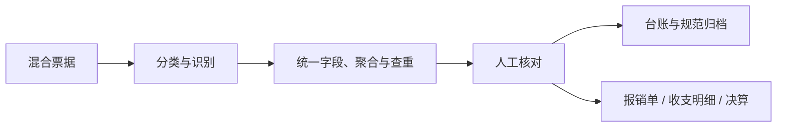

# 全部门通用 Skill

这里存放不依赖部门职责、四个部门均可直接调用的技能。

| Skill | 用途 |
| --- | --- |
| [Himice 操作费用报销](himice-expense-reimbursement-sop/SKILL.md) | 票据分类、识别、查重、归档、报销台账及项目收支明细更新。 |

## 操作费用报销详情

- **适用输入**：电子发票 PDF、纸质票据照片、支付截图、滴滴行程单和用户提供的公司模板。
- **主要输出**：发票查重台账、规范化票据副本文件夹、按开票月归档、待审核报销数据；模板齐全时更新正式报销单、项目收支明细和决算。
- **关键边界**：没有正式模板时不仿造表单；同一交易的行程单、发票和支付记录只入账一次；公司、报销人、部门、用途和付款状态缺失时标记待确认。
- **测试与验收**：[脱敏样例](../../tests/fixtures/himice-expense-reimbursement-sop.md) · [验收清单](../../tests/checklists/himice-expense-reimbursement-sop.md)。

部门展示：项目部/事业部、创意部、综合部和投资部的导航页均引用本技能的同一真实目录。
