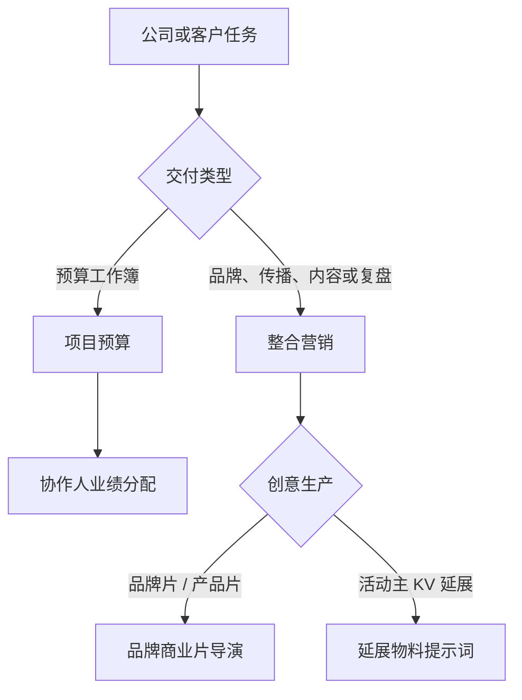

# 公司通用 Skill

这里存放跨两个及以上部门的流程与能力。技能只有一个真实目录，各部门导航按职责展示。

| Skill | 主用/协作部门 | 用途 |
| --- | --- | --- |
| [Himice 项目预算](himice-budget-sop/SKILL.md) | 项目部/事业部主用；综合部协作 | 根据客户报价创建或更新项目预算表。 |
| [Himice 协作人业绩分配](himice-collaborator-allocation-sop/SKILL.md) | 项目部/事业部主用；综合部协作 | 创建或更新项目预算发起时的协作人分配表。 |
| [Himice 整合营销](himice-integrated-marketing-sop/SKILL.md) | 项目部/事业部、创意部主用；投资部材料支持 | 品牌定位、活动传播、内容创作、竞品研究和效果复盘。 |
| [Himice 延展物料提示词](himice-event-material-prompt-sop/SKILL.md) | 创意部主用；项目部/事业部需求与落地 | 为活动主 KV 匹配样机并输出延展物料提示词。 |
| [Himice 品牌商业片导演](himice-brand-commercial-director-sop/SKILL.md) | 创意部主用；项目部/事业部负责客户 Brief 与审批 | 为品牌片、产品片和社媒广告产出导演阐述、镜头表、逐镜提示词、后期与 QC。 |

## 何时选择哪个 Skill

| Skill | 必需输入 | 主要输出 | 不能代替 |
| --- | --- | --- | --- |
| 项目预算 | 客户报价、预算模板和六项项目表头信息 | 项目预算工作簿、公式与渲染核验 | 供应商成本确认、最终财务审批 |
| 协作人业绩分配 | 项目/客户事实、营业额、毛利率、已确认角色和比例 | 预算发起阶段的预估分配表 | 项目结束后的最终分配审批 |
| 整合营销 | 品牌上下文、唯一目标、受众、行动和可用证据 | 定位、传播 Brief、内容、渠道排期、研究或复盘 | 广告账户、CRM、付款操作及未经授权的品牌事实 |
| 延展物料提示词 | 活动主 KV 和目标物料/场景 | 23 类样机中的匹配项、双图提示词和印前提醒 | 印刷生产文件、中文/二维码校对和设计定稿 |
| 品牌商业片导演 | 客户 Brief、品牌事实、授权资产、片长/画幅和目标平台 | 导演阐述、镜头表、资产账本、逐镜提示词、后期与 QC | 客户/品牌/法务审批，或精确 Logo/包装文字的纯生成 |

完整的逐 Skill 流程图、测试入口和使用边界见[仓库首页](../../README.md#业务-skill-详细说明)。
